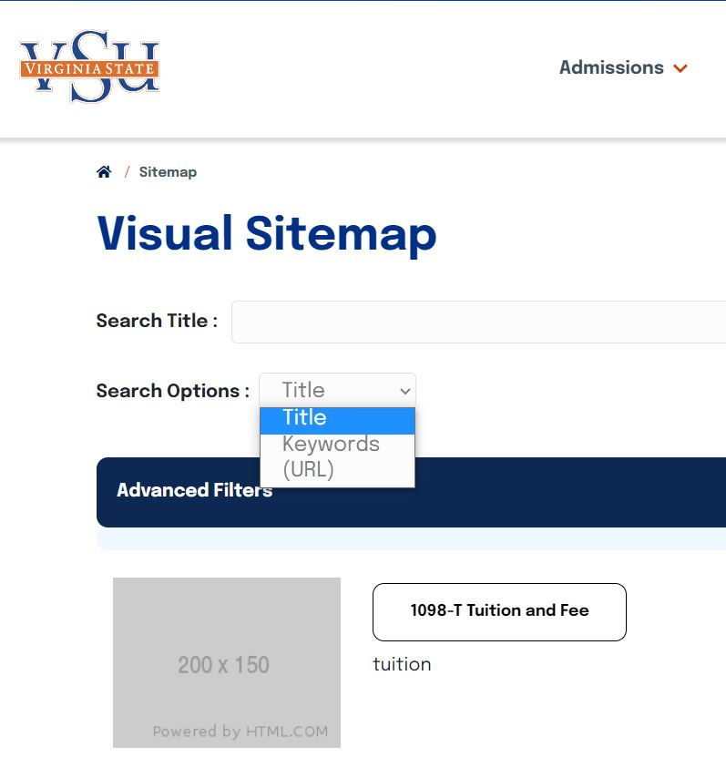
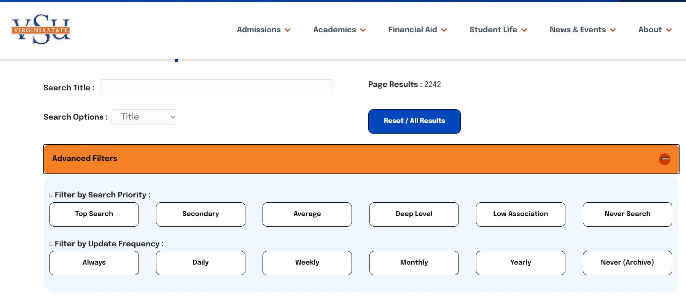
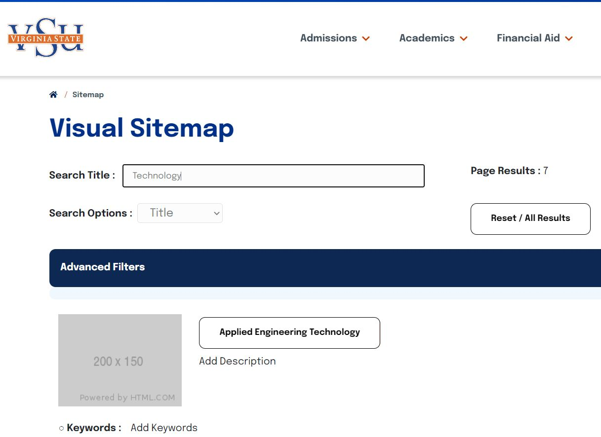
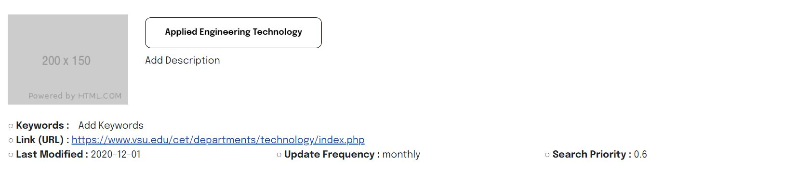

# sitemap-visual
> A visual searchable representation of the sitemap.xml file for VSU

> Cascade CMS Dependent Technologies

---

## Users
- VSU Technology Services employees for webpage auditing
- Public users can use visual sitemap for advanced search capabilities
---

## Functions
This web application provides a searchable function of all .php webpages located on: https://www.vsu.edu

There is a live version located here: https://www.vsu.edu/sitemap-visual.php 

---

User is presented with sitemap-visual search with all results listed and page results

By default, search text input can be filered by **keywords**, **page title**, and **URLs**

Under *Advanced Filters*, user is able to filter results by **Search Priority** and **Page Frequency**.  These search parameters are metadata found in https://www.vsu.edu/sitemap.xml

As user types in search text input, results populate automatically, updating the **Page Results count**

Results display with an open graph image and metadata along with the URL and link of each page found.

---

### Installation

To have a local install of the working project you would need to have the following:

- xampp
- Sublime text editor
- Download of local files through GitHub desktop app

---

## Overview

The sitemap-visual app was developed in order to audit webpage metadata for SEO analysis.  A secondary function allows users to search the VSU website more effectively than the current search.

---

### Visual Sitemap Technical Functions
- the sitemap.xml URL is fed into function `getXMLSitemapObject()` and `parseXMLSitemap()` in order to get sitemap content, parse and teturn a XML DOM object
- a callback function with the parameter `sitemapObject` is ran to create an array of URLs which is iterated through, parsing metatag information of each entry
- div elements are created with corresponding `changefreq` and `priority` dynamic metatag information
- a `data` object literal of a deferred promise function generating the `title`, `loc`, `lastmod`, `changefreq`, and `priority` within html structure and appending it within the div elements created earlier.
